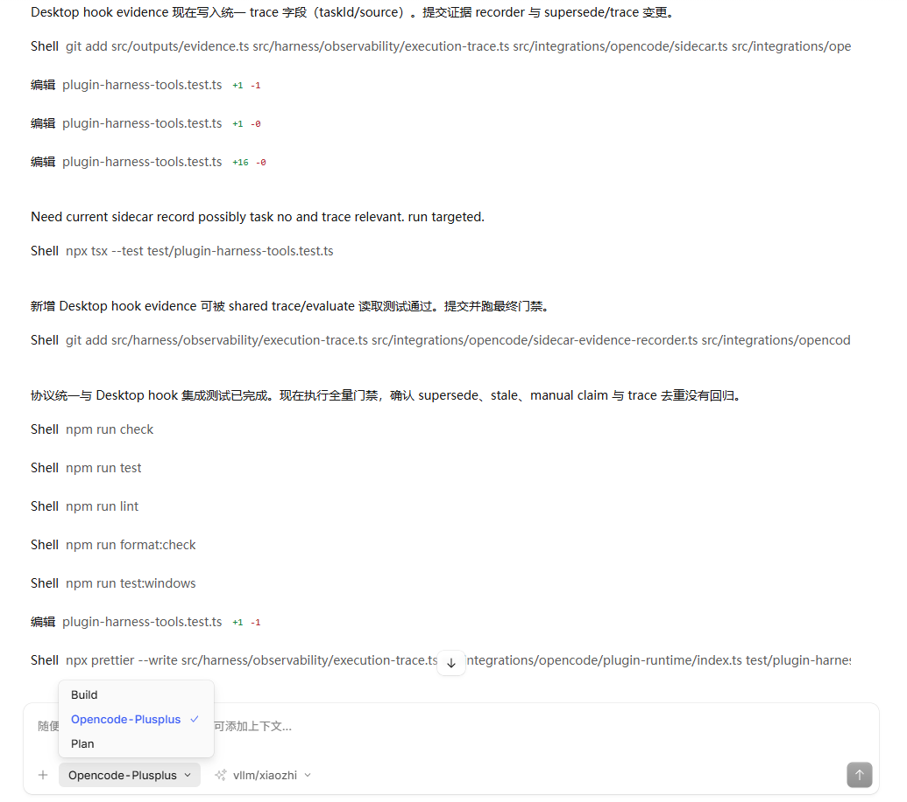
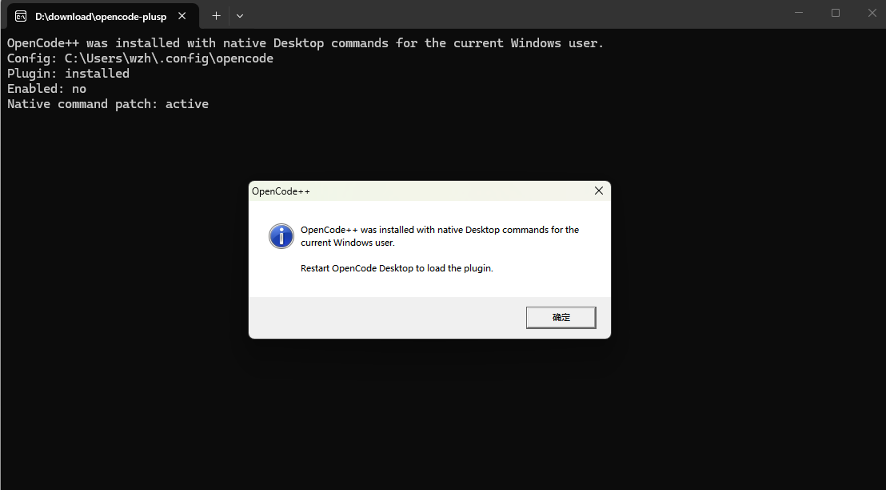

# OpenCode++

[中文说明](README.zh-CN.md)

**A Windows-first Harness plugin for the official OpenCode Desktop application.**

## What Problem It Solves

An AI coding session can produce a plausible diff while reading the wrong files, editing outside the intended scope, running an unrelated command, or declaring success without fresh test evidence. OpenCode++ adds a verification control plane around OpenCode Desktop so the model has to work from repository context, explicit edit boundaries, traceable evidence, and a final decision.

OpenCode++ is not another chat application and it is not a replacement model. It is a user-level Desktop plugin that observes the tools OpenCode already exposes and provides Harness tools for:

- selecting relevant files and symbols before blind search;
- preparing task boundaries and required checks;
- guarding commands and protected paths;
- recording sanitized execution evidence against the current working tree;
- evaluating policy, freshness, regression, hallucination, and convergence gates;
- explaining whether the next action is repair, repack, human review, or finalize.

## What It Can Do Now

The Windows installer adds one selectable OpenCode primary mode named **OpenCode++**. Select it from the mode picker shown at the bottom of the prompt box, then describe the coding task normally. There are no OpenCode++ Slash Commands to remember.



When the mode is selected, its prompt instructs the current OpenCode model to use the in-process plugin tools. The plugin does not start a second model or a CLI process. It runs inside OpenCode Desktop and writes auditable runtime artifacts into the repository's `.agent-context/` directory.

The EXE installer is per-user, works on Windows x64, and does not require Administrator permission.

## Install And Use

1. Download `opencode-plusplus-setup-win-x64.exe` from [GitHub Releases](https://github.com/whut09/opencode-plusplus/releases).
2. Fully exit OpenCode Desktop.
3. Double-click the EXE and accept the installation message.



4. Restart OpenCode Desktop and open a repository.
5. Select **OpenCode++** in the mode picker.
6. Enter a normal request, such as `Fix the login timeout and add a regression test`.
7. Let the selected mode call `prepare`, `retrieve`, `evaluate`, and `next` while it works. Do not switch back to Build for a task that needs the Harness gates.
8. Inspect `.agent-context/` when you need the trace, findings, required commands, or final report.

The installer writes only these OpenCode configuration files:

```text
<OpenCode config>\plugins\opencode-plusplus.js
<OpenCode config>\agents\opencode-plusplus.md
<OpenCode config>\opencode-plusplus\state.json
<OpenCode config>\opencode-plusplus\installation.json
```

It removes files from older releases that created Slash Commands or patched `app.asar`. It no longer changes the OpenCode Desktop bundle. The default configuration directory is `%USERPROFILE%\.config\opencode`; `OPENCODE_CONFIG_DIR` takes precedence.

## Reports And Boundaries

Runtime evidence is local to each repository:

- `.agent-context/traces/` contains execution and test evidence;
- `.agent-context/runs/` contains task context and edit boundaries;
- `.agent-context/loops/` contains decisions and convergence state;
- `.agent-context/sidecar/latest.md` contains the latest verification summary.

The plugin is not an operating-system sandbox. It cannot stop another application from editing a file, prove business semantics from an exit code, or guarantee that an opaque tool argument is correctly classified. A passing command is evidence, not a complete correctness proof. Blocking results require the selected mode to repair or request human review.

## Customize Your Own Harness

OpenCode++ is intentionally an extension point. If OpenCode feels too permissive, too strict, or simply does not match your team's workflow, fork or extend the plugin and define your own Harness policy instead of hiding the problem in a prompt.

Useful customization points include:

- the primary agent prompt in `src/installer/opencode-plusplus-prompts.ts`;
- command and protected-path rules in `src/integrations/opencode/plugin-runtime/`;
- retrieval ranking in `src/retrievers/` and `src/core/ranker.ts`;
- evidence trust and freshness in `src/outputs/evidence.ts` and `src/harness/verification-plane/`;
- loop stopping and decision arbitration in `src/harness/control-plane/`;
- Desktop-specific tool behavior in `src/integrations/opencode/plugin-runtime/harness/`.

The safe customization pattern is: add a test for the desired policy, change the plugin or agent mode, run the full checks, and distribute a new checksummed Windows installer. Keep the Harness explicit about what it can observe and what remains a human decision.

## Contributing

1. Fork the repository and create a focused branch.
2. Read `AGENTS.md`, the relevant source files, and the matching English and Chinese documentation.
3. Add or update deterministic tests before changing behavior.
4. Keep Desktop runtime artifacts, `dist/`, installer staging, secrets, and local `.agent-context/` files out of commits.
5. Run `npm run check`, `npm run lint`, `npm run format:check`, `npm run docs:bilingual:check`, and `npm test`.
6. For installer changes, also run `npm run build:installer:windows`, `npm run test:installer:windows`, and `npm run release:verify` on Windows.
7. Update both language versions of user-facing documentation and explain compatibility boundaries in the pull request.

See [the documentation index](docs/README.md), [Windows architecture](docs/concepts/windows-plugin-architecture.md), and [the contribution guide](CONTRIBUTING.md).

## Developer Compatibility Surface

The repository retains CLI and MCP entry points for source development, CI, diagnostics, and compatibility integrations. They are not the normal Desktop installation path and are not required by ordinary users.

## License

[MIT](LICENSE)
