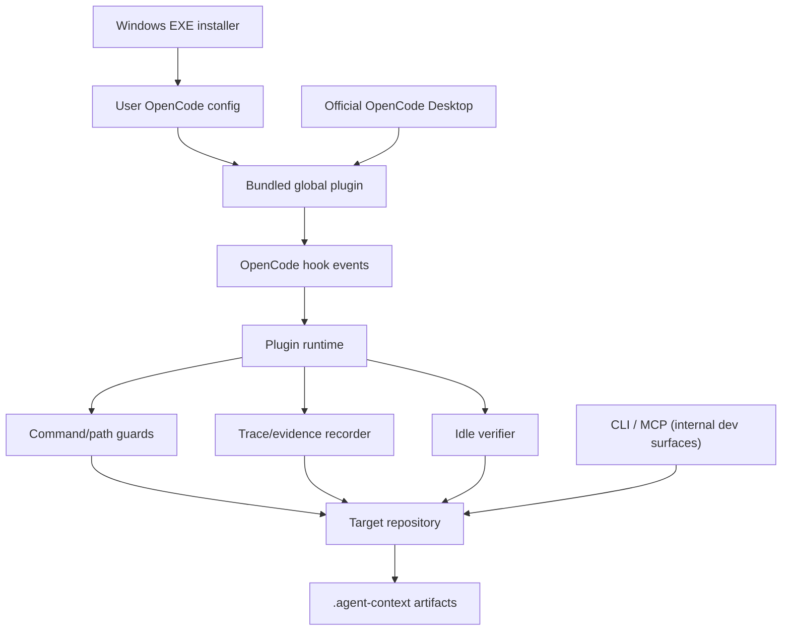

# Windows Plugin Architecture and Boundaries

[中文](windows-plugin-architecture.zh-CN.md) | English

This is the source of truth for the Windows Desktop integration. The product is a user-level OpenCode plugin installed from the release EXE. The Harness runs inside the plugin as in-process tools, and the same primitives are also exposed through the internal CLI/MCP developer surfaces. They share domain logic but do not share control ownership.

## System Model

## Installation Boundary

The EXE is a per-user installer. It writes the bundled plugin, state, installation manifest, three native command menu files, the `/plusplus-task` and `/plusplus-verify` harness workflow commands, and the `opencode-plusplus` skill below the active OpenCode config directory. It also applies a narrow, marker-checked patch to the bundled `SessionPrompt.command` dispatcher so the three native commands run locally without a model turn. The original `app.asar` is backed up and restored on uninstall. The installer does not replace the updater, modify credentials, or install an operating-system service.

esbuild produces a minified CommonJS plugin, then the build compresses it into a small .NET Framework installer. The installer uses the .NET Framework 4.x runtime included with supported Windows 10/11 systems; it does not bundle Node.js, a separate UI runtime, OpenCode, or the source checkout. The build enforces a 12 MiB ceiling and records the exact EXE size and SHA256 in the Desktop release manifest.

## Plugin Boundary

OpenCode owns the model, chat UI, tool dispatch, authentication, process lifecycle, and event delivery. OpenCode++ owns only the plugin callbacks and repository artifacts produced by those callbacks:

| Boundary   | OpenCode owns                        | OpenCode++ owns                                             |
| ---------- | ------------------------------------ | ----------------------------------------------------------- |
| UI         | chat, settings, session display      | model-visible tools; no native settings or direct commands  |
| Execution  | model and tool invocation            | pre-tool command/path checks and post-tool evidence         |
| State      | plugin loading and session lifecycle | enabled state, revision, trace, policy, and sidecar reports |
| Repository | source files and user workflow       | .agent-context runtime outputs                              |
| Security   | host process permissions             | deterministic guard findings, not an OS sandbox             |

## Enable State

The state file is user-scoped and versioned. The plugin remains loaded when enabled is false. Before and after hooks return early, while the three control tools continue to operate. A corrupt or unsupported state file fails closed for protection: the runtime keeps protection enabled and returns a diagnostic instead of silently disabling the guard.

OpenCode Markdown commands are normally model prompt templates, not direct plugin callbacks. The host patch adds a narrow exception for three exact command names; the injected branch reads or updates the OpenCode++ state and appends a local result before normal template handling. It does not provide a general third-party settings panel or change unrelated commands.

## Event and Evidence Flow

1. tool.execute.before normalizes the host input and checks command and paths.
2. The runtime stores a start timestamp and working-tree hash.
3. tool.execute.after normalizes output, captures an exit code when available, redacts secrets, and records hashes/previews.
4. file.edited or file.watcher.updated marks the session dirty.
5. session.created (enabled) marks the repository dirty and schedules a debounced background context build, then toasts "OpenCode++ 已就绪" on success; failures are logged only.
6. session.idle starts incremental verification for the current repository; a failing verify toasts the first blocker with a pointer to `opencode_plusplus_next`.
7. experimental.session.compacting appends the current taskId, edit globs, blocking state, missing evidence, last decision, and sidecar latest summary to `output.context` (never replacing `output.prompt`).
8. session.error is recorded as evidence without interrupting the host.
9. Sidecar reports and traces are atomically persisted under .agent-context.

If the host does not expose a command, exit code, path, or session id, the runtime records an unknown or partial value. It must not invent evidence.

## Artifact Consistency Model

Desktop hooks, CLI diagnostics, and background verification can write to the same repository concurrently. Runtime state, session state, workflow state, execution traces, and Markdown reports therefore use the shared atomic store:

1. A writer acquires a sibling lock file and records its PID, owner token, creation time, and lock schema version.
2. JSON or text is written to a unique temporary file in the target directory, flushed with `fsync`, and renamed over the target. The parent directory is flushed where the platform supports it.
3. Windows replacement retries short `EPERM`, `EACCES`, and `EBUSY` failures caused by antivirus scanning or another process briefly holding the file.
4. Revisioned JSON compares the caller's expected revision while holding the lock. A mismatch returns a revision-conflict diagnostic and never overwrites the newer value.
5. Event JSONL append reads, deduplicates by `eventId`, allocates the next `sequence`, appends, and flushes while holding one lock. Each event also carries `schemaVersion`, `sessionId`, `taskId`, and `timestamp`.

If a process stops before rename, the previous complete file remains readable. Old temporary files and locks owned by dead processes can be cleaned after the stale threshold; a live process's lock or recent temporary file is preserved. Corrupt JSON is reported explicitly at the storage boundary rather than treated as missing state.

Persistence is not a reason to crash OpenCode Desktop. Ordinary lifecycle and after-hook write failures are caught at the plugin boundary and sent to the host logger on a best-effort basis. A deliberate command/path Guard rejection still blocks the unsafe tool call. Repository runtime directories such as `.agent-context/sidecar/`, `.agent-context/traces/`, `.agent-context/runs/`, `.agent-context/loops/`, and `.agent-context/orchestrator/` are local artifacts excluded from Git and npm packages.

## Harness Boundary

The CLI/MCP Harness is a separate control plane and an internal developer/automation surface, not a user installation path. It can build context, invoke an executor, collect a diff, evaluate policy and Guard Gates, and choose finalize, repair, repack, block, rollback, or human-review. The Desktop plugin does not start a multi-loop executor and does not make destructive rollback decisions.

The entry point determines authority:

- Desktop plugin: event-driven and interactive; the host owns execution.
- Agent-led CLI/MCP: the external agent owns execution; OpenCode++ returns reports and constraints.
- Harness-led CLI: OpenCode++ owns bounded orchestration; the external agent remains the code-editing executor.

## Non-Goals

- No second desktop application or separate UI runtime.
- No modification of unrelated Desktop code; the installer only changes the marker-checked `SessionPrompt.command` dispatcher and can restore the original `app.asar`.
- No operating-system sandbox or antivirus replacement.
- No claim that a passing command proves semantic correctness.
- No automatic commit, push, merge, or destructive rollback of the user's worktree.

## Windows Failure Modes

| Failure                                  | Expected behavior                                                                  |
| ---------------------------------------- | ---------------------------------------------------------------------------------- |
| OpenCode is still running during install | Close and restart it so the plugin module is reloaded.                             |
| Custom config directory                  | The installer follows the active OpenCode user configuration.                      |
| Corrupt state JSON                       | Installer reports a diagnostic and does not overwrite it silently.                 |
| Concurrent Desktop hooks                 | Locked append/update preserves events or returns a revision-conflict diagnostic.   |
| Antivirus briefly holds an artifact      | Atomic replacement retries bounded Windows sharing/access failures.                |
| Plugin artifact write fails              | The normal hook returns safely and logs to the host; explicit Guard blocks remain. |
| SmartScreen warning                      | Verify the published SHA256; the release binary is not commercially code-signed.   |
| Legacy project plugin exists             | Remove .opencode/plugins/opencode-plusplus.ts to avoid duplicate hooks.            |
| Another program edits files              | Sidecar cannot observe every external edit; run `/plusplus-verify` in Desktop.     |

## Release Verification Boundary

Windows CI builds the EXE and verifies the release manifest, SHA256, size budget, standalone plugin export, three local command names, patch marker, original backup, interrupted replacement recovery, and uninstall restoration. It also runs a deterministic in-process Desktop Harness benchmark with no model or external executor. A real OpenCode Desktop launch is restricted to the manual `Desktop smoke` workflow on a self-hosted Windows runner with OpenCode preinstalled; PR CI never starts a GUI or calls a paid model.
