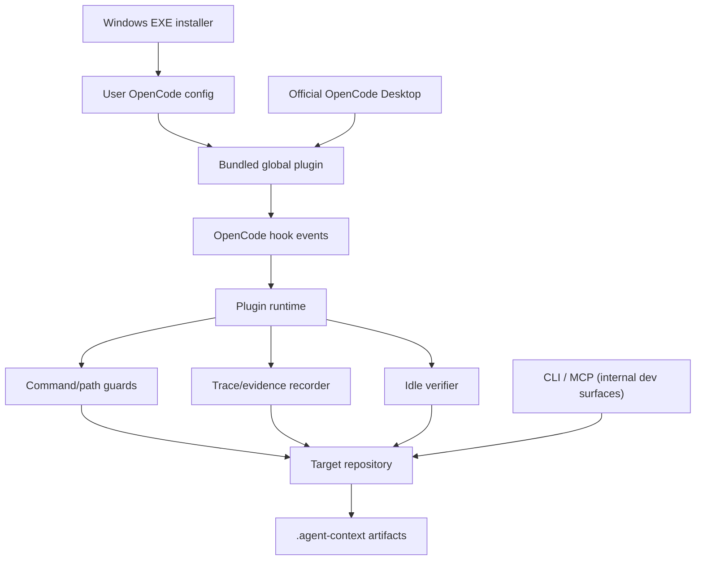

# Windows Plugin Architecture and Boundaries

[中文](windows-plugin-architecture.zh-CN.md) | English

This is the source of truth for the Windows Desktop integration. The product is a user-level OpenCode plugin installed from the release EXE. The Harness runs inside the plugin as in-process tools, and the same primitives are also exposed through the internal CLI/MCP developer surfaces. They share domain logic but do not share control ownership.

## System Model

## Installation Boundary

The EXE is a per-user installer. It writes the bundled plugin, state, installation manifest, three native command menu files, the `/plusplus-task` and `/plusplus-verify` harness workflow commands, and the `opencode-plusplus` skill below the active OpenCode config directory. It also applies a narrow, marker-checked patch to the bundled `SessionPrompt.command` dispatcher so the three native commands run locally without a model turn. The original `app.asar` is backed up and restored on uninstall. The installer does not replace the updater, modify credentials, or install an operating-system service.

esbuild produces a minified CommonJS plugin, then the build compresses it into a small .NET Framework installer. The installer uses the .NET Framework 4.x runtime included with supported Windows 10/11 systems; it does not bundle Node.js, Electron, OpenCode, or the source checkout. The v0.2.2 installer is about 3.5 MiB and expands the plugin into the OpenCode configuration directory during installation.

## Plugin Boundary

OpenCode owns the model, chat UI, tool dispatch, authentication, process lifecycle, and event delivery. OpenCode++ owns only the plugin callbacks and repository artifacts produced by those callbacks:

| Boundary   | OpenCode owns                        | OpenCode++ owns                                             |
| ---------- | ------------------------------------ | ----------------------------------------------------------- |
| UI         | chat, settings, session display      | model-visible tools; no native settings or direct commands  |
| Execution  | model and tool invocation            | pre-tool command/path checks and post-tool evidence         |
| State      | plugin loading and session lifecycle | enabled state, revision, trace, policy, and sidecar reports |
| Repository | source files and user workflow       | .agent-context runtime outputs                              |
| Security   | host process permissions             | deterministic guard findings, not an OS sandbox             |

## Enable State

The state file is user-scoped and versioned. The plugin remains loaded when enabled is false. Before and after hooks return early, while the three control tools continue to operate. A corrupt or unsupported state file fails closed for protection: the runtime keeps protection enabled and returns a diagnostic instead of silently disabling the guard.

OpenCode Markdown commands are normally model prompt templates, not direct plugin callbacks. The host patch adds a narrow exception for three exact command names; the injected branch reads or updates the OpenCode++ state and appends a local result before normal template handling. It does not provide a general third-party settings panel or change unrelated commands.

## Event and Evidence Flow

1. tool.execute.before normalizes the host input and checks command and paths.
2. The runtime stores a start timestamp and working-tree hash.
3. tool.execute.after normalizes output, captures an exit code when available, redacts secrets, and records hashes/previews.
4. file.edited or file.watcher.updated marks the session dirty.
5. session.created (enabled) marks the repository dirty and schedules a debounced background context build, then toasts "OpenCode++ 已就绪" on success; failures are logged only.
6. session.idle starts incremental verification for the current repository; a failing verify toasts the first blocker with a pointer to `opencode_plusplus_next`.
7. experimental.session.compacting appends the current taskId, edit globs, blocking state, missing evidence, last decision, and sidecar latest summary to `output.context` (never replacing `output.prompt`).
8. session.error is recorded as evidence without interrupting the host.
9. Sidecar reports and traces are atomically persisted under .agent-context.

If the host does not expose a command, exit code, path, or session id, the runtime records an unknown or partial value. It must not invent evidence.

## Harness Boundary

The CLI/MCP Harness is a separate control plane and an internal developer/automation surface, not a user installation path. It can build context, invoke an executor, collect a diff, evaluate policy and Guard Gates, and choose finalize, repair, repack, block, rollback, or human-review. The Desktop plugin does not start a multi-loop executor and does not make destructive rollback decisions.

The entry point determines authority:

- Desktop plugin: event-driven and interactive; the host owns execution.
- Agent-led CLI/MCP: the external agent owns execution; OpenCode++ returns reports and constraints.
- Harness-led CLI: OpenCode++ owns bounded orchestration; the external agent remains the code-editing executor.

## Non-Goals

- No second Electron or TUI application.
- No modification of unrelated Desktop code; the installer only changes the marker-checked `SessionPrompt.command` dispatcher and can restore the original `app.asar`.
- No operating-system sandbox or antivirus replacement.
- No claim that a passing command proves semantic correctness.
- No automatic commit, push, merge, or destructive rollback of the user's worktree.

## Windows Failure Modes

| Failure                                  | Expected behavior                                                                 |
| ---------------------------------------- | --------------------------------------------------------------------------------- |
| OpenCode is still running during install | Close and restart it so the plugin module is reloaded.                            |
| Custom config directory                  | Set OPENCODE_CONFIG_DIR or use EXE --config-dir.                                  |
| Corrupt state JSON                       | Installer reports a diagnostic and does not overwrite it silently.                |
| SmartScreen warning                      | Verify the published SHA256; the release binary is not commercially code-signed.  |
| Legacy project plugin exists             | Remove .opencode/plugins/opencode-plusplus.ts to avoid duplicate hooks.           |
| Another program edits files              | Sidecar cannot observe every external edit; run CLI verify or Harness evaluation. |
