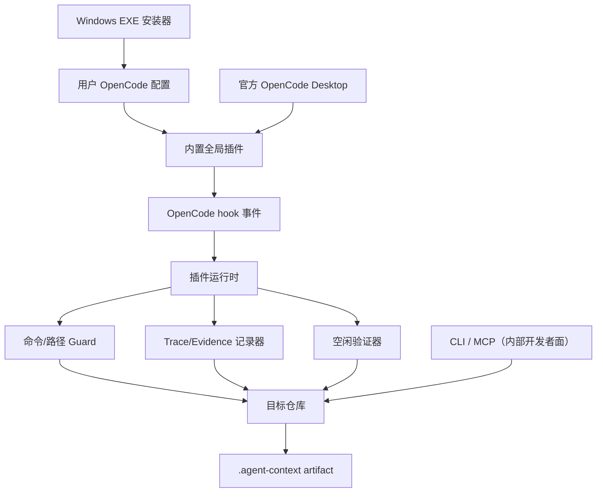

# Windows 插件架构与边界

[English](windows-plugin-architecture.md) | 中文

本文是 Windows Desktop 集成的原理和边界说明。产品是通过 Release EXE 安装的用户级 OpenCode 插件。Harness 作为进程内工具运行在插件内部；同样的实现也通过内部 CLI/MCP 开发者面暴露。它们共享领域实现，但不共享控制权。

## 系统模型

## 安装边界

EXE 是当前用户级安装器。它把内置插件、状态文件、安装清单、三个原生命令菜单文件、`/plusplus-task` 和 `/plusplus-verify` Harness 工作流命令以及 `opencode-plusplus` skill 写入当前 OpenCode 配置目录，并对内置 `SessionPrompt.command` 分发器应用经过特征检查的窄范围补丁，使这三个原生命令可以不经过模型直接执行。原始 `app.asar` 会备份，卸载时恢复。安装器不替换更新器、不修改凭据，也不安装操作系统服务。

esbuild 先生成压缩后的 CommonJS 插件，再把 gzip payload 嵌入小型 .NET Framework 安装器。安装器使用受支持 Windows 10/11 自带的 .NET Framework 4.x，不再携带 Node.js、Electron、OpenCode 或源代码仓库。v0.2.2 安装器约 3.5 MiB，安装时把插件展开到 OpenCode 配置目录。

## 插件边界

OpenCode 负责模型、聊天界面、工具调度、认证、进程生命周期和事件投递。OpenCode++ 只负责插件回调以及由回调产生的仓库 artifact：

| 边界 | OpenCode 负责          | OpenCode++ 负责                                 |
| ---- | ---------------------- | ----------------------------------------------- |
| 界面 | 聊天、设置、会话显示   | 模型可见工具；不提供原生设置页或直接命令        |
| 执行 | 模型和工具调用         | 工具前命令/路径检查、工具后证据记录             |
| 状态 | 插件加载、会话生命周期 | 启用状态、revision、trace、policy、sidecar 报告 |
| 仓库 | 源代码和用户工作流     | .agent-context 运行时输出                       |
| 安全 | 宿主进程权限           | 确定性 Guard finding，不是 OS 沙箱              |

## 启用状态

状态文件是用户级且带版本的。enabled 为 false 时插件仍加载，前后 hook 提前返回，但三个控制工具继续可用。状态文件损坏或版本不支持时，保护逻辑默认保持启用并返回诊断，不会静默关闭 Guard。

OpenCode Markdown Command 默认是模型 Prompt Template，不是插件直接回调。宿主补丁只为三个精确命令增加例外：注入分支直接读取或更新 OpenCode++ state，并在正常模板处理前写入本地结果。它不提供通用第三方设置面板，也不改变其他命令。

## 事件与证据流程

1. tool.execute.before 规范化宿主输入，检查命令和路径。
2. 运行时记录开始时间和 working-tree hash。
3. tool.execute.after 规范化输出，在可用时记录退出码，脱敏密钥并记录 hash/预览。
4. file.edited 或 file.watcher.updated 标记会话 dirty。
5. session.created（启用时）把仓库标记 dirty，并在 debounce 后后台构建 context，成功后弹出 "OpenCode++ 已就绪" toast；失败只记日志。
6. session.idle 为当前仓库启动增量验证；验证未通过时弹出第一条 blocker 的 toast，并提示调用 `opencode_plusplus_next`。
7. experimental.session.compacting 把当前 taskId、编辑 glob、blocking 状态、缺失证据、上次 decision 和 sidecar latest 摘要追加到 `output.context`（绝不替换 `output.prompt`）。
8. session.error 记为证据，不打断宿主。
9. Sidecar 报告和 trace 通过原子方式写入 .agent-context。

如果宿主没有暴露命令、退出码、路径或 session id，运行时记录 unknown 或 partial，不伪造证据。

## Harness 边界

CLI/MCP Harness 是独立控制面，也是内部开发者/自动化面，不是用户安装路径。它可以生成 context、调用 executor、收集 diff、评估 policy 和 Guard Gate，并选择 finalize、repair、repack、block、rollback 或 human-review。Desktop 插件不会启动多轮 executor，也不会对用户工作树执行破坏性回滚。

入口决定权限：

- Desktop 插件：事件驱动、交互式，宿主持有执行权。
- Agent-led CLI/MCP：外部 Agent 持有执行权，OpenCode++ 返回报告和约束。
- Harness-led CLI：OpenCode++ 持有有界编排权，外部 Agent 仍是实际改代码的 executor。

## 非目标

- 不再提供第二个 Electron 或 TUI 应用。
- 不修改无关的 Desktop 代码；安装器只修改经过特征检查的 `SessionPrompt.command` 分发器，并可恢复原始 `app.asar`。
- 不替代操作系统沙箱或杀毒软件。
- 不声称命令通过就等于语义正确。
- 不自动提交、推送、合并或破坏性回滚用户工作树。

## Windows 故障处理

| 故障                     | 预期行为                                                          |
| ------------------------ | ----------------------------------------------------------------- |
| 安装时 OpenCode 仍在运行 | 关闭并重启，让插件模块重新加载。                                  |
| 使用自定义配置目录       | 设置 OPENCODE_CONFIG_DIR 或传 EXE --config-dir。                  |
| 状态 JSON 损坏           | 安装器返回诊断，不静默覆盖。                                      |
| SmartScreen 警告         | 先核对发布的 SHA256；发布二进制未做商业代码签名。                 |
| 存在旧项目插件           | 删除 .opencode/plugins/opencode-plusplus.ts，避免 hook 重复。     |
| 其他程序编辑文件         | Sidecar 无法观察所有外部编辑，应运行 CLI verify 或 Harness 评估。 |
