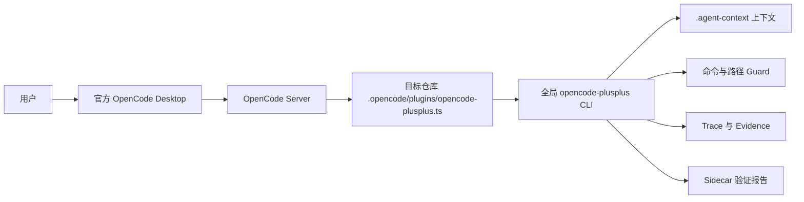

# 在官方 OpenCode Desktop 中使用 OpenCode++

本指南面向已经安装官方 OpenCode Desktop 的 Windows 用户。OpenCode++ 不修改 Desktop 安装目录，也不替换其更新程序；它在目标代码仓库中安装一个 OpenCode 项目插件，并通过本机的 `opencode-plusplus` CLI 提供上下文、命令拦截、证据记录和增量验证。

这与仓库中的实验性 `apps/desktop` 不是同一个应用：

- **官方 OpenCode Desktop + OpenCode++ 插件**：推荐日常使用，聊天和工具界面由官方 Desktop 提供。
- **OpenCode++ Desktop MVP**：本仓库自己的实验性 Electron 外壳，主要用于 Harness 批处理，不是本指南的安装目标。

## 工作方式



Desktop 和 OpenCode TUI 使用同一个项目插件生命周期。插件在 OpenCode 执行工具前后接收 hook：执行前检查危险命令和受保护路径，执行后记录退出码、输出摘要、工作树哈希和涉及文件，仓库发生编辑并进入空闲状态时运行增量验证。

## 前置条件

准备以下环境：

- 已安装并能正常打开官方 OpenCode Desktop。
- Node.js 20 或更高版本，运行 `node --version` 检查。
- npm，运行 `npm --version` 检查。
- Git，运行 `git --version` 检查。
- 目标项目已经是 Git 仓库；尚未初始化时先运行 `git init`。

OpenCode Desktop 自带的服务不能替代 `opencode-plusplus` CLI。项目插件会在后台调用该 CLI，因此必须把 CLI 安装到系统 `PATH`。

## 安装 OpenCode++

### 方式一：安装当前仓库源码（当前推荐）

当前源码可能比 npm 发布版更新。要使用 `E:\codex\opencode-plusplus` 中的最新实现，运行：

```powershell
cd E:\codex\opencode-plusplus
git pull origin main
npm ci
npm run build
npm install --global .
opencode-plusplus --version
Get-Command opencode-plusplus
```

`npm run build` 必须先成功，因为全局安装包运行的是 `dist`。以后拉取新代码后，重新执行 `npm run build` 和 `npm install --global .`。

### 方式二：安装 npm 发布版

`desktop init` 发布到 npm 后，可以改用：

```powershell
npm install --global opencode-plusplus@latest
opencode-plusplus desktop init --help
opencode-plusplus --version
Get-Command opencode-plusplus
```

如果帮助中没有 `desktop init`，说明当前 npm 版本尚未包含官方 Desktop 初始化入口，请使用上面的源码安装方式。

只使用官方 Desktop 时不要求额外安装 `opencode-ai` CLI。只有要从终端启动 OpenCode TUI 或运行 OpenCode batch executor 时，才需要安装 `opencode-ai`。

## 初始化目标项目

在 PowerShell 中进入要交给 OpenCode Desktop 打开的项目，而不是进入 OpenCode++ 自己的源码目录：

```powershell
cd E:\projects\your-project
opencode-plusplus desktop init .
```

该命令不会启动 TUI，也不要求系统存在 `opencode` 命令。它会：

1. 确认当前目录是 Git 仓库。
2. 首次生成 `AGENTS.md` 和 `.agent-context/` 仓库上下文。
3. 生成 `.opencode/commands/opencode-plusplus.md`。
4. 生成 `.opencode/commands/opencode-plusplus-verify.md`。
5. 生成 `.opencode/agents/opencode-plusplus.md`。
6. 生成 `.opencode/plugins/opencode-plusplus.ts` Desktop/Server 项目插件。

常用初始化选项：

```powershell
# 已有 .agent-context 时强制重建上下文
opencode-plusplus desktop init . --refresh-context

# 只安装 OpenCode 项目文件，不生成仓库上下文
opencode-plusplus desktop init . --skip-context

# CLI 升级后覆盖旧插件、commands 和 agent 文件
opencode-plusplus desktop init . --force

# 输出机器可读结果
opencode-plusplus desktop init . --json
```

`--skip-context` 与 `--refresh-context` 不能同时使用。`--force` 会覆盖生成的 command 和 agent 文件；如果手动修改过这些文件，请先备份。

## 在 OpenCode Desktop 中启用

1. 完全关闭目标项目已有的 OpenCode Desktop 会话，或者从 Desktop 中切换到其他项目。
2. 使用 Desktop 的打开项目/文件夹功能，选择刚才执行 `desktop init` 的仓库根目录。
3. 如果初始化前项目已经在 Desktop 中打开，请重新加载或关闭后重新打开，使 OpenCode Server 重新发现 `.opencode/plugins/opencode-plusplus.ts`。
4. 正常新建会话并输入任务，不需要启用额外开关。

例如：

```txt
先阅读登录模块和相关测试，修复登录超时问题，完成后运行最小相关测试。
```

OpenCode++ 默认保持安静。正常命令继续执行；危险命令、未知 package script、受保护路径或 secret 文件会在执行前被阻断。编辑后进入空闲状态时，插件会自动运行增量验证。

## 确认是否生效

初始化后先检查静态状态：

```powershell
opencode-plusplus status .
opencode-plusplus sidecar verify .
```

然后在 Desktop 会话中至少触发一次读文件、编辑或命令工具，再运行：

```powershell
opencode-plusplus status .
opencode-plusplus report .
Get-Content .agent-context\traces\opencode-sidecar-events.jsonl -Tail 20
```

预期信号：

- `plugin: yes`
- `context: yes`
- Desktop 使用工具后出现 `event log: yes`
- `latest report: yes`
- 事件日志包含 `sidecar.check-command`、`sidecar.record-tool`、`session.idle` 或 `sidecar.verify`

第一次运行 `sidecar verify` 时，尚未创建事件日志属于正常 warning；Desktop 真正执行一次工具后才会产生事件。

## 日常使用模式

### 透明 Sidecar 模式

推荐模式。在 Desktop 中像平常一样聊天，OpenCode++ 自动提供：

- `tool.execute.before` 命令和路径拦截；
- `tool.execute.after` command evidence 和 exit code；
- 当前 working tree hash 与 touched files；
- 编辑后的 dirty/debounced 增量验证；
- contracts、hallucination、regression、impact、tests 和 policy Guard；
- `.agent-context/sidecar/latest.md` 最新决策报告。

### 手动验证

需要在提交或合并前明确检查时，在项目终端运行：

```powershell
opencode-plusplus sidecar verify .
opencode-plusplus report .
opencode-plusplus verify --diff .
opencode-plusplus policy . --base main --fail-on required
```

### Harness 批处理模式

这是独立于 Desktop 当前聊天会话的高级模式，会启动配置的 executor：

```powershell
opencode-plusplus oc run "修复登录超时并补回归测试" .
opencode-plusplus oc report --last
```

仅需要 Desktop 内的透明保护时，不必运行 `oc run`。

## 生成文件与 Git 策略

| 路径                                     | 用途                    | 建议提交       |
| ---------------------------------------- | ----------------------- | -------------- |
| `AGENTS.md`                              | Agent 操作规则          | 按团队策略决定 |
| `.agent-context/` 的稳定上下文           | 索引、架构、contracts   | 按团队策略决定 |
| `.opencode/commands/*.md`                | OpenCode slash commands | 可以提交       |
| `.opencode/agents/opencode-plusplus.md`  | OpenCode agent profile  | 可以提交       |
| `.opencode/plugins/opencode-plusplus.ts` | 本机插件入口            | 默认不要提交   |
| `.agent-context/traces/`                 | 本机执行证据            | 不提交         |
| `.agent-context/sidecar/`                | 本机最新验证报告        | 不提交         |
| `.agent-context/cache/`                  | 本机缓存                | 不提交         |

当前生成的插件入口包含本机 OpenCode++ 安装位置的绝对 `file:` URL。团队成员应分别运行 `opencode-plusplus desktop init . --force` 生成自己的插件，不要共享另一台机器生成的入口文件。

建议在目标项目 `.gitignore` 中加入：

```gitignore
.opencode/plugins/opencode-plusplus.ts
.agent-context/traces/
.agent-context/sidecar/
.agent-context/cache/
```

## 升级

升级 npm 发布版：

```powershell
npm update --global opencode-plusplus
cd E:\projects\your-project
opencode-plusplus desktop init . --force --refresh-context
```

升级当前源码安装：

```powershell
cd E:\codex\opencode-plusplus
git pull origin main
npm ci
npm run build
npm install --global .

cd E:\projects\your-project
opencode-plusplus desktop init . --force --refresh-context
```

然后重新打开 Desktop 项目。重新生成插件很重要，因为插件头部记录 CLI 版本并引用当前安装位置。

## 暂时禁用或卸载

只对某个项目禁用：

```powershell
Remove-Item .opencode\plugins\opencode-plusplus.ts
```

完全卸载 CLI：

```powershell
npm uninstall --global opencode-plusplus
```

删除插件后重新打开 Desktop 项目。`.agent-context` 中的上下文和本地报告不会被自动删除，可按项目需要保留或手动清理。

## Windows 排障

### 找不到 `opencode-plusplus`

```powershell
Get-Command opencode-plusplus
npm prefix --global
```

Windows 的 npm 全局可执行目录通常是 `%AppData%\npm`。确认该目录在用户 `PATH` 中，修改后重新启动 PowerShell 和 OpenCode Desktop。

### Desktop 没有加载插件

```powershell
opencode-plusplus desktop init . --force
Test-Path .opencode\plugins\opencode-plusplus.ts
Get-Content .opencode\plugins\opencode-plusplus.ts
```

确认插件存在后完全关闭并重新打开项目。插件中的 `import` 路径必须指向当前机器上实际存在的 OpenCode++ `dist` 文件。

### 没有事件日志

先在 Desktop 中让 OpenCode 执行一次文件读取或普通命令，再检查：

```powershell
Test-Path .agent-context\traces\opencode-sidecar-events.jsonl
opencode-plusplus status .
```

仍不存在时，通常是项目未重新加载、插件 import 路径失效，或 Desktop 进程启动时没有继承包含 npm 全局目录的 `PATH`。修复 `PATH` 后重启 Desktop。

### 命令被阻断

```powershell
opencode-plusplus report .
opencode-plusplus sidecar check-command . --command "npm run test" --json
```

检查命令是否引用不存在的 `package.json` script、包含 shell 控制符、触碰 secret/protected path，或属于破坏性命令。不要为了绕过 Guard 而删除证据或修改报告文件。

### 插件版本不一致

```powershell
opencode-plusplus --version
opencode-plusplus desktop init . --force
```

重新打开项目后再运行 `opencode-plusplus status .`。如果全局安装位置发生变化，必须重新生成插件。
