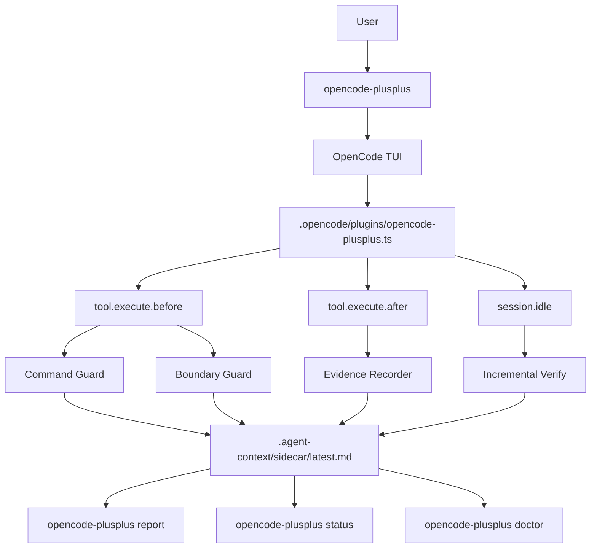

# OpenCode Transparent Sidecar Mode

OpenCode Transparent Sidecar Mode is the default `opencode-plusplus` experience. Users keep working in the normal OpenCode TUI while OpenCode++ runs as a quiet reliability layer around the session.

OpenCode++ does not replace OpenCode. OpenCode reads, edits, and runs tools; OpenCode++ prepares repository context, installs the sidecar plugin, records execution evidence, blocks unsafe commands or paths, and writes verification reports.

## OpenCode Desktop

The current OpenCode Desktop is a client for the same OpenCode server/plugin lifecycle. OpenCode++ therefore integrates at the project plugin boundary instead of patching the Desktop renderer or replacing the Desktop updater.

OpenCode++ generates `.opencode/plugins/opencode-plusplus.ts` inside the selected repository. When that repository is opened in OpenCode Desktop, the same plugin can:

- block dangerous commands and protected paths before execution;
- capture tool arguments, exit status, sanitized output hashes, session IDs, call IDs, and working-tree hashes;
- run debounced verification after edits and idle sessions;
- expose the latest Sidecar decision through `.agent-context/sidecar/latest.md` and Harness run reports through `.agent-context/orchestrator/<run-id>/orchestrator.json`.

Initialize the repository before opening it in Desktop:

```bash
opencode-plusplus desktop init .
opencode-plusplus sidecar verify .
```

For source installation, Windows setup, upgrades, generated-file policy, and troubleshooting, read [在官方 OpenCode Desktop 中使用 OpenCode++](opencode-desktop.zh-CN.md).

The generated runtime supports both the legacy OpenCode hook shape and the current plugin API, where `tool.execute.before` receives tool metadata as the first argument and tool arguments as `output.args`. `callID` is used to correlate before/after evidence.

The plugin does not inject an Electron window or modify OpenCode Desktop binaries. A future companion package can add a native Desktop panel through a documented Desktop extension point, but the current stable boundary is the project plugin plus MCP/CLI reports. This keeps OpenCode Desktop upgrades independent from OpenCode++ release upgrades.

## User Experience

Install OpenCode++ and OpenCode globally:

```bash
npm i -g opencode-plusplus opencode-ai
```

Then enter the repository where you want the sidecar:

```bash
cd your-repo
opencode-plusplus
```

`opencode-plusplus` runs preflight, prints a compact readiness summary, and then launches OpenCode:

```txt
OpenCode++ sidecar ready
- Context: ready (.agent-context already exists)
- Plugin: ready (.opencode/plugins/opencode-plusplus.ts generated)
- Report: .agent-context/sidecar/latest.md

Launching OpenCode...
```

Then use OpenCode normally:

```txt
Fix the login timeout bug.
Add tests for this module.
Refactor this function while preserving behavior.
```

The sidecar stays quiet by default. It only surfaces a TUI message when a blocker or forbidden gate is detected.

## Workflow



```txt
opencode-plusplus
  -> preflight
  -> ensure .agent-context
  -> ensure .opencode plugin / commands / agent profile
  -> launch OpenCode TUI
  -> listen for OpenCode events
  -> record tool evidence
  -> dirty/debounced sidecar verify
  -> write latest report
```

The generated OpenCode plugin listens for:

- `tool.execute.before`: blocks dangerous commands, hallucinated package scripts / Makefile targets, protected paths, and secret paths.
- `tool.execute.after`: records command, exit code when available, timestamps, stdout/stderr hashes, sanitized and truncated output previews, working-tree hashes, and touched files. Large output is passed to `record-tool` through a JSON evidence file instead of command-line arguments.
- `file.edited` and `file.watcher.updated`: marks the repository dirty.
- `session.idle`: runs dirty/debounced incremental verification.

## Generated Files

```txt
.opencode/plugins/opencode-plusplus.ts
.opencode/commands/opencode-plusplus.md
.opencode/commands/opencode-plusplus-verify.md
.opencode/agents/opencode-plusplus.md
.agent-context/sidecar/latest.json
.agent-context/sidecar/latest.md
.agent-context/sidecar/policy.md
.agent-context/sidecar/task-verify.md
.agent-context/sidecar/hallucination.md
.agent-context/sidecar/regression.md
.agent-context/traces/opencode-sidecar-events.jsonl
.agent-context/traces/tool-evidence/opencode-tool-*.json
.agent-context/traces/opencode-session-<id>.json
```

`.agent-context/traces/opencode-sidecar-events.jsonl` is the low-level event stream. `.agent-context/traces/tool-evidence/opencode-tool-*.json` stores sanitized after-tool evidence payloads used by `record-tool`; it does not store raw long stdout/stderr. `.agent-context/traces/opencode-session-<id>.json` is the normalized execution trace consumed by Evidence Guard and Policy Engine.

## Common Commands

```bash
opencode-plusplus
opencode-plusplus desktop init .
opencode-plusplus --pure
opencode-plusplus status
opencode-plusplus report
opencode-plusplus doctor
opencode-plusplus sidecar verify
```

`opencode-plusplus --pure` launches plain OpenCode without generating context or injecting the sidecar.

`opencode-plusplus status` checks whether the sidecar plugin, event log, and latest report exist.

`opencode-plusplus report` opens `.agent-context/sidecar/latest.md`.

`opencode-plusplus doctor` checks OpenCode, auth, git, context, sidecar plugin readiness, and CLI/plugin version consistency.

`opencode-plusplus sidecar verify` runs the shared guard stack and writes the latest sidecar report. It is also what the plugin runs automatically on idle when the repository is dirty.

## Difference From Batch Mode

| Mode                | Command                                      | Best for                                                   | Who drives the loop                                             |
| ------------------- | -------------------------------------------- | ---------------------------------------------------------- | --------------------------------------------------------------- |
| Transparent Sidecar | `opencode-plusplus`                          | Daily OpenCode-style chat coding                           | OpenCode drives editing; OpenCode++ quietly guards and verifies |
| Batch Harness       | `opencode-plusplus oc run "task"`            | Benchmark, CI-like runs, scripted repair, repeatable demos | OpenCode++ drives plan / execute / evaluate / repair            |
| Core Harness        | `opencode-plusplus verify/policy/impact/...` | Advanced manual verification and automation                | User or CI calls specific guard commands                        |

Transparent Sidecar mode optimizes for a natural interactive coding experience. Batch Harness mode optimizes for repeatability and stronger OpenCode++ control.

## Troubleshooting

```bash
opencode-plusplus doctor
opencode-plusplus status
opencode-plusplus report
opencode-plusplus sidecar verify .
```

If the plugin is stale or missing, rerun:

```bash
opencode-plusplus desktop init . --force
```

If you want to use OpenCode without OpenCode++ for a session:

```bash
opencode-plusplus --pure
```

If copy/paste feels intercepted inside the OpenCode TUI, use your terminal-level paste shortcut, such as `Ctrl+Shift+V`, right-click paste, or the terminal menu. OpenCode++ launches OpenCode with inherited stdio so terminal clipboard handling stays outside the sidecar.
