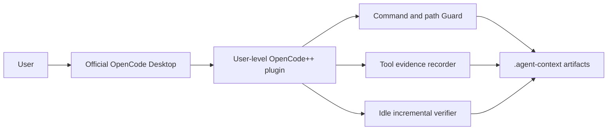

# OpenCode Global Sidecar

OpenCode++ is a global OpenCode plugin for the official OpenCode Desktop application. The installer places the bundled plugin in the user OpenCode configuration directory; it does not patch Desktop binaries or add a second desktop shell.

## Runtime Boundary



The plugin hooks `tool.execute.before`, `tool.execute.after`, `file.edited`, `file.watcher.updated`, and `session.idle`. It blocks dangerous commands and protected paths before execution, records sanitized evidence after execution, and runs the shared verification stack after a dirty session becomes idle.

## Control Surface

The plugin exposes three tools:

- `opencode_plusplus_status`
- `opencode_plusplus_enable`
- `opencode_plusplus_disable`

The installer also registers `/opencode-plusplus-status`, `/opencode-plusplus-on`, and `/opencode-plusplus-off`. OpenCode Desktop invokes these through its normal chat and command UI. The plugin remains loaded while disabled so status and re-enable remain available.

## Repository Artifacts

The plugin writes runtime evidence and reports under `.agent-context/`, including sidecar events, traces, policy output, and the latest verification report. These files are local runtime artifacts and should normally stay out of commits. Stable generated context may be committed according to the repository policy.

## Batch Harness

The Desktop plugin and the harness-led executor are separate paths. Use the batch flow when OpenCode++ should own the bounded loop:

```bash
opencode-plusplus oc run "fix the login timeout bug" . --max-loops 3
opencode-plusplus oc report --last
```

The batch path produces explicit `finalize`, `repair`, `repack`, `block`, `rollback`, or `human-review` decisions. The Desktop plugin provides transparent protection for the active chat session.

## Troubleshooting

Check that the global plugin exists, then fully restart Desktop:

```powershell
Test-Path "$env:USERPROFILE\.config\opencode\plugins\opencode-plusplus.js"
```

Use the in-Desktop status tool first. For repository artifacts, inspect `.agent-context/sidecar/latest.md` or run `opencode-plusplus sidecar verify .` from a terminal.
