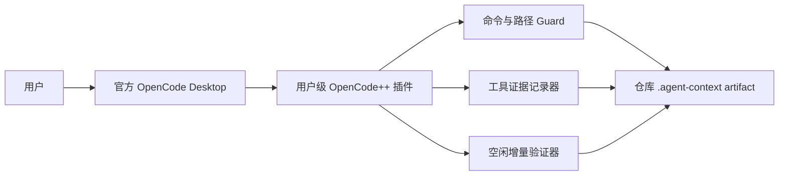

# OpenCode 全局 Sidecar

[English](opencode-sidecar.md) | 中文

OpenCode++ 是运行在 Windows 官方 OpenCode Desktop 内的全局插件。安装器把自包含的 CommonJS 插件写入用户 OpenCode 配置目录。日常交互不依赖源代码仓库，也不依赖 OpenCode++ CLI。

## 运行边界



插件处理 `tool.execute.before`、`tool.execute.after`、`file.edited`、`file.watcher.updated` 和 `session.idle`。OpenCode 主程序仍负责模型执行、工具调度、界面、认证和进程生命周期。

## 控制入口

插件把 `opencode_plusplus_status`、`opencode_plusplus_enable` 和 `opencode_plusplus_disable` 暴露为模型可见工具。Windows 安装器还会写入三个命令菜单项，并补丁它们的精确分发器名称，使其不经过模型直接本地执行。禁用后插件仍加载，只跳过 Guard、证据记录和空闲验证。在 Desktop 外也可以使用安装器 EXE 的 `--status`、`--enable` 或 `--disable`。

## 证据与 Artifact

工具调用完成后，插件记录脱敏预览和 hash，不保留不受限制的完整输出。宿主提供退出码时记录退出码，否则结果为 `unknown`。在能够确定时记录调用前后 working-tree hash 和变更路径。报告和 trace 通过共享原子存储写入当前仓库的 `.agent-context/`。

Sidecar 是证据采集和验证层，不是单元测试、代码审查、CI、操作系统沙箱，也不是防止其他应用修改文件的安全边界。

## 与批处理 Harness 的关系

Desktop Sidecar 是会话级、事件驱动的；CLI/MCP Harness 可以持有有界多轮流程：

```powershell
opencode-plusplus orchestrate "修复登录超时并补回归测试" . --executor opencode --max-loops 3 --fail-on required
```

两条路径共享 Guard、Evidence、Policy 和决策实现，但只有 Harness-led 路径持有 executor 调用权和终止循环决策。

## 排障

1. 安装或升级后完全重启 OpenCode。
2. 使用 `--status --json` 检查当前配置目录和插件文件。
3. 在新会话中调用 `opencode_plusplus_status`。
4. 编辑文件并触发 idle 后查看 `.agent-context/sidecar/latest.md`。
5. 删除旧的 `.opencode/plugins/opencode-plusplus.ts`。

安装路径和生命周期见 [Windows 安装与使用](opencode-desktop.zh-CN.md)。
